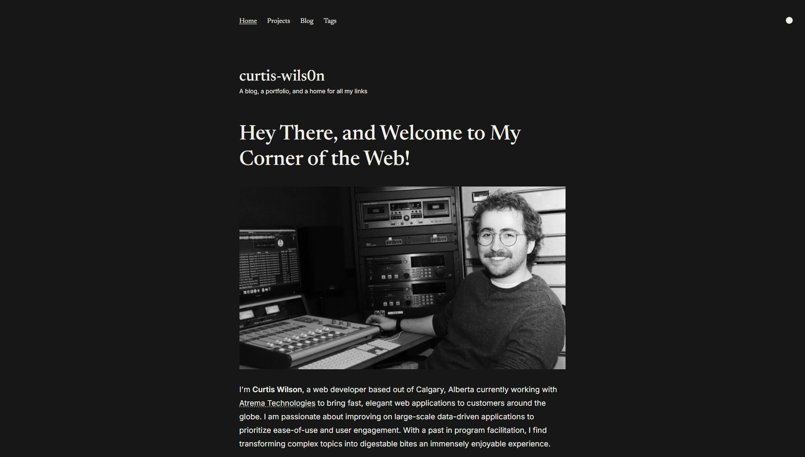

# A Blog and Portfolio

A repository for Curtis Wilson's portfolio and blog, found [here](https://curtis-wils0n.netlify.app).

## How to Build Locally

All commands are run from the root of the project, from a terminal:

| Command                   | Action                                           |
| :------------------------ | :----------------------------------------------- |
| `npm install`             | Installs dependencies                            |
| `npm run dev`             | Starts local dev server at `localhost:4321`      |
| `npm run build`           | Build your production site to `./dist/`          |
| `npm run preview`         | Preview your build locally, before deploying     |
| `npm run astro ...`       | Run CLI commands like `astro add`, `astro check` |
| `npm run astro -- --help` | Get help using the Astro CLI                     |

## Astro Themes by Just Good UI

- [Dante](https://github.com/JustGoodUI/dante-astro-theme) is a free single-author blog and portfolio theme.

## License

Licensed under the [GPL-3.0](https://github.com/JustGoodUI/dante-astro-theme/blob/main/LICENSE) license.
